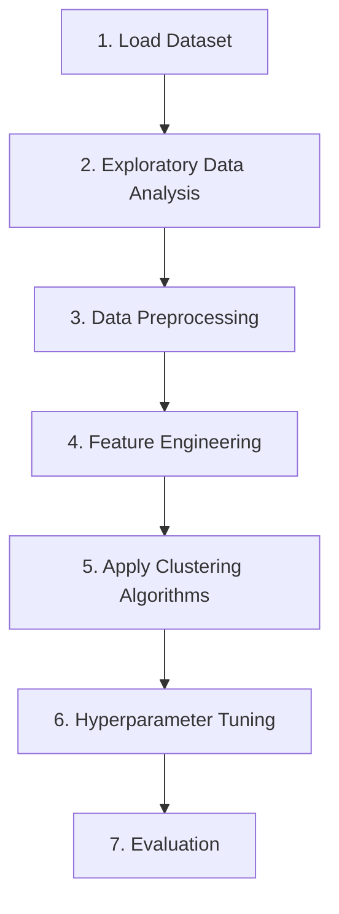

# Practice 3 - Customer Clustering

## Giới thiệu

Đây là bài thực hành về học không giám sát (Unsupervised Learning), tập trung vào bài toán phân cụm khách hàng (Customer Clustering).

Thông qua việc phân tích các đặc điểm của khách hàng, mục tiêu của bài thực hành là khám phá các nhóm khách hàng có hành vi và đặc trưng tương đồng, từ đó xác định các phân khúc khách hàng khác nhau nhằm hỗ trợ doanh nghiệp xây dựng chiến lược tiếp cận phù hợp.

## Bối cảnh bài toán

Một công ty ô tô có kế hoạch mở rộng sang các thị trường mới với các sản phẩm hiện có (P1, P2, P3, P4 và P5). Sau quá trình nghiên cứu thị trường, công ty nhận thấy rằng hành vi của khách hàng tại thị trường mới tương đối giống với thị trường hiện tại.

Nhiệm vụ đặt ra là sử dụng các phương pháp học không giám sát để phân nhóm khách hàng dựa trên sự tương đồng giữa các đặc trưng của họ, từ đó xác định các phân khúc khách hàng riêng biệt.

## Mục tiêu

* Khám phá các nhóm khách hàng dựa trên đặc điểm và hành vi của họ.
* So sánh hiệu quả của nhiều thuật toán phân cụm khác nhau.
* Lựa chọn thuật toán phân cụm phù hợp nhất dựa trên các độ đo đánh giá.
* Phân tích và trực quan hóa các cụm khách hàng thu được.

## Dữ liệu sử dụng

Bộ dữ liệu gốc được lấy từ [Kaggle](https://www.kaggle.com/datasets/vetrirah/customer) và bao gồm hai tập dữ liệu:

* `train.csv`
* `test.csv`

Trong đó:

* `train.csv` chứa đầy đủ các thuộc tính của khách hàng và cột `Segmentation`.
* `test.csv` không chứa nhãn phân khúc khách hàng.

Trong phạm vi bài thực hành này, quá trình phân cụm chủ yếu được thực hiện trên tập `train.csv`. Cột `Segmentation` không được sử dụng trong quá trình huấn luyện mô hình, vì đây là bài toán `Unsupervised Learning`.

## Các thuộc tính của bộ dữ liệu

| Thuộc tính      | Mô tả                                                     |
| --------------- | --------------------------------------------------------- |
| ID              | Mã định danh khách hàng                                   |
| Gender          | Giới tính                                                 |
| Ever_Married    | Tình trạng hôn nhân                                       |
| Age             | Tuổi                                                      |
| Graduated       | Trình độ học vấn                                          |
| Profession      | Nghề nghiệp                                               |
| Work_Experience | Số năm kinh nghiệm làm việc                               |
| Spending_Score  | Mức độ chi tiêu                                           |
| Family_Size     | Số lượng thành viên trong gia đình                        |
| Var_1           | Biến phân loại ẩn danh                                    |
| Segmentation    | Nhãn phân khúc khách hàng (chỉ xuất hiện trong tập train) |

---

## Các thuật toán được sử dụng

Trong bài thực hành, nhiều thuật toán phân cụm sẽ được áp dụng và so sánh:

* K-Means
* K-Medoids
* DBSCAN
* Hierarchical Clustering

---

## Quy trình thực hiện

## Kết quả mong đợi

* So sánh hiệu quả của các thuật toán phân cụm.
* Tìm ra mô hình phân cụm phù hợp nhất.
* Xác định được các nhóm khách hàng có đặc điểm tương đồng.
* Phân tích đặc điểm của từng nhóm khách hàng.
* Trực quan hóa các cụm khách hàng thu được.
* Hỗ trợ doanh nghiệp hiểu rõ hơn về hành vi của khách hàng để xây dựng chiến lược kinh doanh phù hợp.
